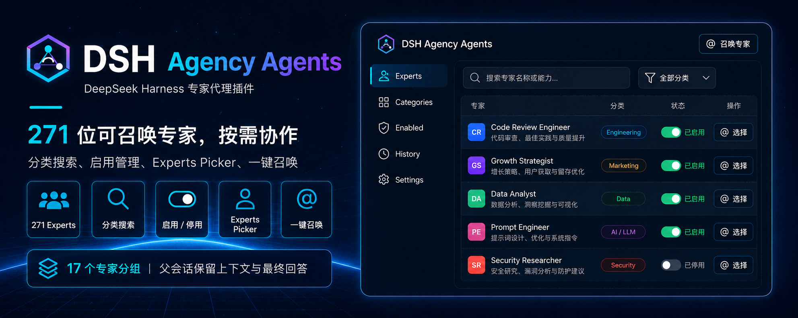

<div align="center">
  
</div>

<div align="center">

  # DSH Agency Agents

  **为 DeepSeek Harness 提供 321 名可召唤的专业智能体**

  [English](README.md) · [专家列表](#专家列表) · [安装](#安装) · [更新日志](CHANGELOG.zh-CN.md) · [Apache-2.0](LICENSE)

  [](LICENSE)
  [](#专家列表)
  [](https://www.npmjs.com/package/@michengai/dsh-agency-agents)
  [](https://www.npmjs.com/package/@michengai/dsh-agency-agents)
  [](https://github.com/MichengAI/dsh-agency-agents)
  [](https://nodejs.org/)
</div>

> DSH Agency Agents 是社区维护的 DeepSeek Harness（DSH）插件，并非 DeepSeek AI 官方产品。

## 功能概览

- 在「设置 → 专家」中按分类筛选或搜索，再启用或停用内置专家。
- 在输入框的「专家」中按当前语言的名称召唤已启用的专家处理完整任务。
- 提供 `list_experts` 与 `summon_expert` 工具，分别用于发现专家和启动一次性子代理。
- 内置 321 份 persona，无需额外下载；也可接入自行同步的专家目录。
- 可把一句话复制到 DSH、Codex 或 WorkBuddy，让对方代装到本机 DSH。

主会话保留任务上下文、判断和最终交付；专家子代理只提供专业视角，不能继续召唤专家，避免递归委派。

## 界面预览

在「设置 → 专家」中按分类筛选或搜索，再启用需要的专家：


在输入框用 `@` 或「专家」选择已启用的专家：


回填当前语言的专家名称标签后，写出完整任务：


## DSH 产品生态

本产品既可以独立安装，也可以随桌面端或 Web 套件一起使用。它们共享同一个 DSH 核心，但面向不同的使用方式：

| 产品 | 与本产品的关系 |
| --- | --- |
| [DeepSeek Harness](https://github.com/deepseek-ai/deepseek-harness) | 本产品的运行宿主，提供模型、会话、工具和插件系统 |
| [DSH Codex Desktop](https://github.com/MichengAI/dsh-codex-desktop) | 下载安装即用的桌面产品，已内置本产品和其他 5 个功能产品 |
| 6 个功能产品 | [Codex UI](https://github.com/MichengAI/dsh-codex-ui) · [IM Connect](https://github.com/MichengAI/dsh-im-connect) · [Automation](https://github.com/MichengAI/dsh-automation) · [Skills Manager](https://github.com/MichengAI/dsh-skills-manager) · [Archive Manager](https://github.com/MichengAI/dsh-archive-manager) · [Agency Agents](https://github.com/MichengAI/dsh-agency-agents) |

## 前置条件

- 已可正常运行 DeepSeek Harness Web，且可在 PowerShell 中使用 `dsh`。
- 以下示例使用 `web` profile；请替换为实际目标 profile。
- 从源码安装或二次开发需要 Node.js 22+ 与 pnpm；仅从 npm 安装无需单独执行 `pnpm install`。

## 安装

`dsh plugin add` 会转发到 profile 目录里的 `pnpm add`。不写版本、不指定官方源时，本机镜像和最短发布间隔可能让你停在旧版。

### 交给其他 Agent 一句话安装

本插件运行在 DeepSeek Harness Web 里。把下面其中一句复制到 DSH、Codex 或 WorkBuddy，让它代你安装到本机 `web` profile。

从 npm 安装：

```text
请把 DSH 插件 @michengai/dsh-agency-agents 最新版装进本机 web profile，使用官方 npm 源执行：dsh plugin --profile web add @michengai/dsh-agency-agents@latest --registry=https://registry.npmjs.org/。装完执行 dsh --profile web --dump-config，确认已挂载 agency-agents，并提醒我重启 DSH Web 后硬刷新浏览器。
```

从源码安装：

```text
请从源码安装 DSH 插件 https://github.com/MichengAI/dsh-agency-agents：克隆到本机后执行 pnpm install --frozen-lockfile 和 pnpm build，再用 dsh plugin --profile web add . 把当前目录装进 web profile。不要只复制 lib。装完执行 dsh --profile web --dump-config，确认已挂载 agency-agents，并提醒我重启 DSH Web 后硬刷新浏览器。
```

| 产品 | 怎么用 |
| --- | --- |
| DSH | 把上面其中一句发给当前会话。 |
| Codex | 把上面其中一句发给 Codex，让它在本机执行安装。 |
| WorkBuddy | 把上面其中一句发给 WorkBuddy；源码安装也可同时粘贴仓库地址 `https://github.com/MichengAI/dsh-agency-agents`。 |

Codex 和 WorkBuddy 只负责代装；装好后仍要打开 DSH Web 使用「设置 → 专家」。

也可以自己执行同一条 npm 命令：

```powershell
dsh plugin --profile web add @michengai/dsh-agency-agents@latest --registry=https://registry.npmjs.org/
```

未把 `dsh` 装进 PATH 时，把开头的 `dsh` 换成 `npx --yes @deepseek-ai/dsh`。

### 从官方 npm 安装最新版

在任意 PowerShell 目录执行：

```powershell
[Console]::OutputEncoding = [System.Text.Encoding]::UTF8
$OutputEncoding = [System.Text.Encoding]::UTF8
dsh plugin --profile web add @michengai/dsh-agency-agents@latest --registry=https://registry.npmjs.org/
dsh --profile web --dump-config
```

需要钉死某一版时，把 `@latest` 换成具体版本，例如 `@0.1.17`。

配置输出中应包含 `agency-agents` 与 `agency-agents-remote`。安装后重启 DSH Web 并在浏览器硬刷新；请勿手工复制客户端文件，否则设置页所需的 Remote 服务不会被挂载。

### 从源码安装

适用于调试或使用未发布改动。克隆后的本地路径就是插件安装路径：

```powershell
[Console]::OutputEncoding = [System.Text.Encoding]::UTF8
$OutputEncoding = [System.Text.Encoding]::UTF8
Set-Location D:\Repository\deepseek-harness-plugin
git clone https://github.com/MichengAI/dsh-agency-agents.git
Set-Location .\dsh-agency-agents
pnpm install --frozen-lockfile
pnpm build
dsh plugin --profile web add .
dsh --profile web --dump-config
```

完成后重启 DSH Web 并硬刷新浏览器。`dsh plugin ... add .` 会读取当前目录的包信息和 `cordis.patch.yml`；不要改为直接复制 `lib` 目录。

## 使用

1. 打开「设置 → 专家」，启用需要的专家。
2. 在对话输入框用 `@` 或点击「专家」，选择已启用的专家。
3. 当前语言的专家名称会以短标签写入输入框；在其后补充完整任务。例如：

```text
代码审查工程师

审查当前工作区的改动，按严重程度列出可复现的问题。
```

也可由主会话先调用 `list_experts(division?)` 查找专家，再使用 `summon_expert(expert, task)` 按专家名称委派任务。内置名册会校验中英文名称唯一。

<a id="专家列表"></a>

## 🎨 专家列表

内置 **321 名专家，覆盖 22 个分类**。点击专家名称查看中文角色定义。

### 分类导航

| 分类 | 专家数 |
| --- | ---: |
| [工程](#experts-engineering) | 68 |
| [设计](#experts-design) | 11 |
| [市场营销](#experts-marketing) | 43 |
| [付费媒体](#experts-paid-media) | 7 |
| [销售](#experts-sales) | 9 |
| [公司经营](#experts-company) | 6 |
| [金融](#experts-finance) | 9 |
| [人力资源](#experts-hr) | 2 |
| [法务](#experts-legal) | 2 |
| [供应链](#experts-supply-chain) | 4 |
| [产品](#experts-product) | 5 |
| [项目管理](#experts-project-management) | 7 |
| [测试](#experts-testing) | 10 |
| [支持](#experts-support) | 7 |
| [安全](#experts-security) | 12 |
| [专业](#experts-specialized) | 68 |
| [空间计算](#experts-spatial-computing) | 6 |
| [游戏开发](#experts-game-development) | 21 |
| [学术](#experts-academic) | 7 |
| [地理信息](#experts-gis) | 13 |
| [医疗健康](#experts-healthcare) | 3 |
| [研究](#experts-research) | 1 |

<a id="experts-engineering"></a>

### 💻 工程

构建未来，一个 commit 一个脚印。

| 专家 | 专长 | 适用场景 |
| --- | --- | --- |
| 🎨 [前端开发者](assets/agency-agents-zh/engineering/engineering-frontend-developer.md) | React/Vue、UI 实现、性能优化 | 现代 Web 应用、像素级 UI |
| 🏗️ [后端架构师](assets/agency-agents-zh/engineering/engineering-backend-architect.md) | API 设计、数据库架构、可扩展性 | 服务端系统、微服务 |
| 📱 [移动应用开发工程师](assets/agency-agents-zh/engineering/engineering-mobile-app-builder.md) | iOS/Android 原生、跨平台框架 | 移动端开发、App 性能优化 |
| 🤖 [AI 工程师](assets/agency-agents-zh/engineering/engineering-ai-engineer.md) | 机器学习、模型部署、AI 集成 | ML 功能、数据管线 |
| 🚀 [DevOps 自动化工程师](assets/agency-agents-zh/engineering/engineering-devops-automator.md) | CI/CD、基础设施自动化 | 流水线开发、部署自动化 |
| 🌐 [网络工程师](assets/agency-agents-zh/engineering/engineering-network-engineer.md) | Cisco/Juniper/Palo Alto、路由交换、防火墙 | BGP/OSPF 配置、ACL 调整、网络排障 |
| ⚡ [快速原型工程师](assets/agency-agents-zh/engineering/engineering-rapid-prototyper.md) | 快速 POC、MVP 开发 | 概念验证、黑客马拉松 |
| 💎 [高级开发者](assets/agency-agents-zh/engineering/engineering-senior-developer.md) | Laravel/Livewire/FluxUI、高端 CSS、Three.js | 高品质 Web 体验 |
| 🔧 [Filament 后台优化专家](assets/agency-agents-zh/engineering/engineering-filament-optimization-specialist.md) | Filament PHP 后台重构、高影响力改造 | PHP 后台管理优化 |
| ⚡ [自动化优化架构师](assets/agency-agents-zh/engineering/engineering-autonomous-optimization-architect.md) | 自适应系统、自动调优 | 智能运维、自愈系统 |
| 🔩 [嵌入式固件工程师](assets/agency-agents-zh/engineering/engineering-embedded-firmware-engineer.md) | RTOS、外设驱动、低功耗设计 | IoT、嵌入式系统 |
| 🚨 [故障应急工程师](assets/agency-agents-zh/engineering/engineering-incident-response-commander.md) | 故障处置、SLO 管理、事后复盘 | 线上故障、应急响应 |
| ⛓️ [Solidity 智能合约工程师](assets/agency-agents-zh/engineering/engineering-solidity-smart-contract-engineer.md) | Solidity、EVM、Gas 优化、DeFi | 智能合约开发、Web3 |
| 🧭 [工程效率工程师](assets/agency-agents-zh/engineering/engineering-codebase-onboarding-engineer.md) | 源码阅读、调用链追踪、代码结构说明 | 新成员上手、陌生代码库理解 |
| 📚 [技术文档工程师](assets/agency-agents-zh/engineering/engineering-technical-writer.md) | API 文档、开发者文档、docs-as-code | 技术文档、知识库 |
| 💬 [微信小程序开发者](assets/agency-agents-zh/engineering/engineering-wechat-mini-program-developer.md) | WXML/WXSS、微信支付、云开发 | 微信小程序全栈开发 |
| 👁️ [代码审查工程师](assets/agency-agents-zh/engineering/engineering-code-reviewer.md) | 代码审查、安全审计、质量把关 | PR 审查、代码质量 |
| 🗄️ [数据库性能工程师](assets/agency-agents-zh/engineering/engineering-database-optimizer.md) | Schema 设计、查询优化、索引策略 | 数据库性能调优 |
| 🌿 [Git 工作流工程师](assets/agency-agents-zh/engineering/engineering-git-workflow-master.md) | 分支策略、约定式提交、变基 | Git 工作流规范 |
| 🏛️ [软件架构师](assets/agency-agents-zh/engineering/engineering-software-architect.md) | 系统设计、DDD、架构决策 | 系统架构设计 |
| 🛡️ [SRE（站点可靠性工程师）](assets/agency-agents-zh/engineering/engineering-sre.md) | SLO、可观测性、混沌工程 | 站点可靠性工程 |
| 🧬 [AI 数据治理工程师](assets/agency-agents-zh/engineering/engineering-ai-data-remediation-engineer.md) | 自愈管道、SLM 语义聚类、零数据丢失 | 大规模数据异常修复 |
| 🔧 [数据工程师](assets/agency-agents-zh/engineering/engineering-data-engineer.md) | ETL/ELT、数据湖、Spark/dbt | 数据管线、数据仓库 |
| 🔗 [飞书集成开发工程师](assets/agency-agents-zh/engineering/engineering-feishu-integration-developer.md) | 飞书机器人、审批流、多维表格 | 飞书生态集成开发 |
| 🧱 [CMS 开发者](assets/agency-agents-zh/engineering/engineering-cms-developer.md) | Drupal/WordPress、主题开发、自定义插件 | CMS 站点开发与内容架构 |
| 📧 [邮件系统工程师](assets/agency-agents-zh/engineering/engineering-email-intelligence-engineer.md) | 邮件解析、结构化提取、AI 推理数据 | 智能体邮件集成 |
| 🎙️ [语音 AI 集成工程师](assets/agency-agents-zh/engineering/engineering-voice-ai-integration-engineer.md) | Whisper/ASR、音频处理、说话人分离 | 语音转写管线、字幕生成、业务集成 |
| 🖧 [IT 服务经理](assets/agency-agents-zh/engineering/engineering-it-service-manager.md) | ITIL、服务目录、SLA、配置库 | IT 事件与变更管理、服务质量改进 |
| 🪡 [低风险变更工程师](assets/agency-agents-zh/engineering/engineering-minimal-change-engineer.md) | 最小范围修改、回归控制、问题修复 | 边界明确的小修复、低风险代码变更 |
| 📜 [OrgScript 工程师](assets/agency-agents-zh/engineering/engineering-orgscript-engineer.md) | OrgScript 语法、AST 校验、业务规则 | 业务脚本定义、解析器与引擎实现 |
| 🧬 [提示词工程师](assets/agency-agents-zh/engineering/engineering-prompt-engineer.md) | 提示词设计、评测、迭代优化 | 将模糊需求转化为稳定的 AI 行为 |
| 🕸️ [多智能体系统架构师](assets/agency-agents-zh/engineering/engineering-multi-agent-systems-architect.md) | 智能体拓扑、上下文、信任与故障恢复 | 多智能体架构设计、治理与人工介入 |
| 🛒 [Drupal 购物车工程师](assets/agency-agents-zh/engineering/engineering-drupal-shopping-cart.md) | Drupal Commerce、支付、结算、促销 | Drupal 商城开发与交易流程配置 |
| 🛍️ [WordPress 购物车工程师](assets/agency-agents-zh/engineering/engineering-wordpress-shopping-cart.md) | WooCommerce、支付网关、购物车、优惠券 | WordPress 商城搭建、结算转化优化 |
| 💳 [支付计费工程师](assets/agency-agents-zh/engineering/engineering-payments-billing-engineer.md) | 支付渠道、幂等、回调、订阅计费 | Stripe/Adyen 集成、支付对账、订阅管理 |
| 🌍 [国际化工程师](assets/agency-agents-zh/engineering/engineering-i18n-engineer.md) | 多语言文案、复数规则、RTL、本地化格式 | 应用国际化改造、多语言测试 |
| ⚡ [Drupal 性能工程师](assets/agency-agents-zh/engineering/engineering-drupal-performance.md) | 缓存、BigPipe、Views 查询、PHP-FPM | Drupal 性能调优、Core Web Vitals 优化 |
| ⚡ [WordPress 性能工程师](assets/agency-agents-zh/engineering/engineering-wordpress-performance.md) | 对象缓存、页面缓存、查询与静态资源 | WordPress 性能调优、页面速度优化 |
| ♿ [无障碍合规工程师](assets/agency-agents-zh/engineering/engineering-section-508-specialist.md) | Section 508、WCAG、ARIA、VPAT | 联邦网站无障碍审计、界面改造 |
| 🏛️ [USWDS 开发者](assets/agency-agents-zh/engineering/engineering-uswds-developer.md) | USWDS 组件、设计令牌、无障碍模式 | 美国政府网站前端开发、CMS 集成 |
| 🔎 [搜索相关性工程师](assets/agency-agents-zh/engineering/engineering-search-relevance-engineer.md) | 索引、BM25、混合检索、nDCG | 搜索排序调优、相关性评测与实验 |
| 🔐 [身份与访问管理工程师](assets/agency-agents-zh/engineering/engineering-identity-access-engineer.md) | OAuth/OIDC、SSO、SCIM、RBAC/ABAC | 身份认证、企业账号接入、权限体系建设 |
| 🤝 [实时协作工程师](assets/agency-agents-zh/engineering/engineering-realtime-collaboration-engineer.md) | WebSocket、在线状态、协同编辑、同步 | 实时协作、冲突处理、离线恢复 |
| 💻 [桌面应用工程师](assets/agency-agents-zh/engineering/engineering-desktop-app-engineer.md) | Electron/Tauri、原生集成、签名与更新 | 跨平台桌面应用开发、打包发布 |
| 🚀 [移动发布工程师](assets/agency-agents-zh/engineering/engineering-mobile-release-engineer.md) | 签名证书、fastlane、商店提审、分批发布 | iOS/Android 打包、CI/CD 与上架 |
| 🎬 [视频流工程师](assets/agency-agents-zh/engineering/engineering-video-streaming-engineer.md) | HLS/DASH、转码、DRM、CDN | 视频点播与直播、播放质量优化 |
| 💰 [FinOps 工程师](assets/agency-agents-zh/engineering/engineering-finops-engineer.md) | 云费用分摊、资源规格、成本看板 | 云成本治理、预算跟踪、资源优化 |
| 🧩 [WebAssembly 工程师](assets/agency-agents-zh/engineering/engineering-webassembly-engineer.md) | Rust/C++、WebAssembly、WASI、JS 互操作 | 浏览器高性能计算、原生代码移植 |
| 🔌 [API 平台工程师](assets/agency-agents-zh/engineering/engineering-api-platform-engineer.md) | OpenAPI/gRPC、网关、版本治理、SDK | API 平台建设、鉴权限流、开发者接入 |
| 🛟 [数据库可靠性工程师](assets/agency-agents-zh/engineering/engineering-database-reliability-engineer.md) | 主从复制、自动切换、备份恢复 | 数据库高可用、容灾、无停机变更 |
| 🛠️ [开发者工具工程师](assets/agency-agents-zh/engineering/engineering-developer-tooling-engineer.md) | CLI、命令补全、跨平台分发 | 内部研发工具、开发流程提效 |
| 📡 [物联网设备工程师](assets/agency-agents-zh/engineering/engineering-iot-fleet-engineer.md) | 设备注册、MQTT、OTA、边缘计算 | 大规模设备接入、升级回滚、在线运维 |
| 🔍 [RAG 管线工程师](assets/agency-agents-zh/engineering/engineering-rag-pipeline-engineer.md) | 分块、混合检索、重排、检索评测 | 生产级 RAG 管线建设与召回优化 |
| 🗄️ [GaussDB 专家工程师](assets/agency-agents-zh/engineering/engineering-gaussdb-expert.md) | GaussDB OLTP、分布式表、查询与索引 | GaussDB 架构设计、性能调优与迁移 |
| 🕵️ [隐私工程师](assets/agency-agents-zh/engineering/engineering-privacy-engineer.md) | 敏感数据识别、最小化采集、删除与留存 | 隐私要求落地、数据删除流程自动化 |
| 🦀 [Rust 重构工程师](assets/agency-agents-zh/engineering/engineering-rust-refactoring-specialist.md) | Rust 模块拆分、错误处理、Clippy | Rust 代码重构、重复清理、行为保持 |
| 🧪 [LLM 后训练工程师](assets/agency-agents-zh/engineering/engineering-llm-post-training-engineer.md) | SFT、偏好优化、强化学习微调 | 大模型后训练实验、模型发布评估 |
| 📈 [数据可视化工程师](assets/agency-agents-zh/engineering/engineering-data-visualization-engineer.md) | 图表选型、D3/Vega、交互与渲染性能 | 数据看板、交互图表、大数据量可视化 |
| 🧠 [知识图谱工程师](assets/agency-agents-zh/engineering/engineering-knowledge-graph-engineer.md) | 实体关系建模、知识图谱、图增强检索 | 知识组织、上下文导航、RAG 能力组合 |
| 🔗 [钉钉集成开发工程师](assets/agency-agents-zh/engineering/engineering-dingtalk-integration-developer.md) | 钉钉机器人、酷应用、连接器 | 钉钉生态集成开发 |
| 🔌 [嵌入式 Linux 驱动工程师](assets/agency-agents-zh/engineering/engineering-embedded-linux-driver-engineer.md) | 内核模块、设备树、Platform/I2C/SPI 驱动 | 嵌入式 Linux BSP 开发 |
| 🔬 [FPGA/ASIC 数字设计工程师](assets/agency-agents-zh/engineering/engineering-fpga-digital-design-engineer.md) | Verilog/SystemVerilog、时序收敛、AXI 总线 | FPGA 开发、数字逻辑设计 |
| 📡 [IoT 方案架构师](assets/agency-agents-zh/engineering/engineering-iot-solution-architect.md) | MQTT/CoAP、边缘计算、设备管理、云平台 | 物联网端到端方案设计 |
| ⚙️ [机械设计工程师](assets/agency-agents-zh/engineering/engineering-mechanical-design-engineer.md) | 传动选型、强度刚度疲劳振动校核、DFMA、GB/ISO 标准件 | 工业装备、自动化产线、检测仪器 |
| 🌐 [国内网络工程师](assets/agency-agents-zh/engineering/engineering-network-engineer-china.md) | 华为 VRP/华三 Comware/锐捷、VLAN/OSPF/BGP/VXLAN、信创国产化、等保组网 | 国产设备园区网/数据中心/广域网 |
| 🖥️ [上位机工程师](assets/agency-agents-zh/engineering/engineering-pc-host-engineer.md) | Qt/QML、QSerialPort、Modbus/CAN、QChart 实时可视化 | 工业上位机、检测设备、HMI |
| 🔒 [安全工程师](assets/agency-agents-zh/engineering/engineering-security-engineer.md) | 威胁建模、代码审计、安全架构 | 应用安全、漏洞评估 |
| 🛡️ [威胁检测工程师（工程侧）](assets/agency-agents-zh/engineering/engineering-threat-detection-engineer.md) | SIEM、威胁狩猎、检测规则 | 安全运营、威胁检测 |

<a id="experts-design"></a>

### 🎨 设计

让产品好看、好用，保持一致的体验。

| 专家 | 专长 | 适用场景 |
| --- | --- | --- |
| 🎯 [UI 设计师](assets/agency-agents-zh/design/design-ui-designer.md) | 视觉设计、组件库、设计系统 | 界面设计、品牌一致性 |
| 🔍 [UX 研究员](assets/agency-agents-zh/design/design-ux-researcher.md) | 用户测试、行为分析 | 用户研究、可用性测试 |
| 🏛️ [UX 架构师](assets/agency-agents-zh/design/design-ux-architect.md) | 信息架构、交互设计、导航系统 | 复杂产品的 UX 架构 |
| 🎭 [品牌视觉设计师](assets/agency-agents-zh/design/design-brand-guardian.md) | 品牌标识、一致性、定位 | 品牌策略、视觉规范 |
| 📖 [视觉传达设计师](assets/agency-agents-zh/design/design-visual-storyteller.md) | 数据可视化、视觉叙事 | 信息图、演示文稿 |
| ✨ [创意设计师](assets/agency-agents-zh/design/design-whimsy-injector.md) | 微交互、彩蛋、趣味元素 | 产品细节体验提升 |
| 📷 [AI 图像设计师](assets/agency-agents-zh/design/design-image-prompt-engineer.md) | AI 图像生成、提示词优化 | Midjourney/DALL-E 出图 |
| 🌈 [无障碍设计师](assets/agency-agents-zh/design/design-inclusive-visuals-specialist.md) | 多元化视觉、无障碍设计 | 包容性设计、全球化视觉 |
| 🎭 [用户体验设计师](assets/agency-agents-zh/design/design-persona-walkthrough.md) | 用户画像、认知走查、转化率分析 | 网页体验评审、逐屏问题定位、转化优化 |
| 🧱 [UI 视觉验收设计师](assets/agency-agents-zh/design/design-ui-finish-gate-reviewer.md) | 设计契约、视觉一致性、界面验收 | 发布前 UI 评审、通用化界面整改 |
| 🎬 [视频提示词工程师](assets/agency-agents-zh/design/design-video-prompt-engineer.md) | 文生视频提示词、5 段式结构、运镜与负面词 | Sora / 可灵 / Veo / Seedance 出片 |

<a id="experts-marketing"></a>

### 📢 市场营销

连接内容、渠道与受众，推动持续增长。

| 专家 | 专长 | 适用场景 |
| --- | --- | --- |
| 🚀 [增长营销专家](assets/agency-agents-zh/marketing/marketing-growth-hacker.md) | 快速获客、病毒循环、实验 | 用户增长、转化优化 |
| 📝 [内容创作者](assets/agency-agents-zh/marketing/marketing-content-creator.md) | 多平台内容、编辑日历 | 内容策略、品牌故事 |
| 🐦 [Twitter 互动运营](assets/agency-agents-zh/marketing/marketing-twitter-engager.md) | 实时互动、思想领袖 | 出海品牌社交 |
| 🛰️ [X/Twitter 舆情分析师](assets/agency-agents-zh/marketing/marketing-x-twitter-intelligence-analyst.md) | X/Twitter 监测、趋势识别、风险信号 | 品牌舆情研究、账号与话题情报 |
| 📱 [TikTok 运营专家](assets/agency-agents-zh/marketing/marketing-tiktok-strategist.md) | 病毒式内容、算法优化 | 出海短视频营销 |
| 📸 [Instagram 运营](assets/agency-agents-zh/marketing/marketing-instagram-curator.md) | 视觉叙事、社区运营 | 出海视觉营销 |
| 🤝 [Reddit 社区运营](assets/agency-agents-zh/marketing/marketing-reddit-community-builder.md) | 社区文化、真实互动 | 出海社区营销 |
| 📱 [应用商店优化师](assets/agency-agents-zh/marketing/marketing-app-store-optimizer.md) | ASO、转化优化 | App 出海推广 |
| 🌐 [社媒运营专家](assets/agency-agents-zh/marketing/marketing-social-media-strategist.md) | 跨平台策略、整合营销 | 全渠道社交运营 |
| 📕 [小红书运营专家](assets/agency-agents-zh/marketing/marketing-xiaohongshu-specialist.md) | 生活方式内容、趋势策略 | 小红书品牌建设 |
| 💬 [公众号运营](assets/agency-agents-zh/marketing/marketing-wechat-official-account.md) | 订阅者运营、内容营销 | 微信公众号增长 |
| 🧠 [知乎运营专家](assets/agency-agents-zh/marketing/marketing-zhihu-strategist.md) | 知识型内容、思想领袖建设 | 知乎品牌权威 |
| 🇨🇳 [百度 SEO 专家](assets/agency-agents-zh/marketing/marketing-baidu-seo-specialist.md) | 百度优化、百科/知道/贴吧生态 | 百度搜索营销 |
| 🎬 [B站内容运营专家](assets/agency-agents-zh/marketing/marketing-bilibili-content-strategist.md) | B 站选题、UP 主合作、弹幕互动 | 视频播放增长、账号内容运营 |
| 🎠 [内容增长运营专家](assets/agency-agents-zh/marketing/marketing-carousel-growth-engine.md) | 轮播图内容、自动化投放 | 社交媒体轮播素材 |
| 💼 [LinkedIn 内容创作者](assets/agency-agents-zh/marketing/marketing-linkedin-content-creator.md) | LinkedIn 职场内容、B2B 获客 | LinkedIn 品牌建设 |
| 🛒 [中国电商运营](assets/agency-agents-zh/marketing/marketing-china-ecommerce-operator.md) | 淘宝/拼多多/京东、广告投放、大促作战 | 电商全链路深度运营 |
| 🎥 [快手运营专家](assets/agency-agents-zh/marketing/marketing-kuaishou-strategist.md) | 下沉市场、老铁文化、直播电商 | 快手运营、社区信任 |
| 🔍 [SEO 专家](assets/agency-agents-zh/marketing/marketing-seo-specialist.md) | 搜索引擎优化、技术 SEO | Google SEO、内容优化 |
| 📘 [图书策划编辑](assets/agency-agents-zh/marketing/marketing-book-co-author.md) | 思想领袖力图书、代笔协作 | 图书策划与撰写 |
| 🌏 [跨境电商专家](assets/agency-agents-zh/marketing/marketing-cross-border-ecommerce.md) | Amazon/Shopee/Lazada、海外仓、品牌出海 | 跨境电商全链路运营 |
| 🎵 [抖音运营专家](assets/agency-agents-zh/marketing/marketing-douyin-strategist.md) | 短视频策划、算法优化、直播带货 | 抖音增长、短视频营销 |
| 🎙️ [直播电商运营专家](assets/agency-agents-zh/marketing/marketing-livestream-commerce-coach.md) | 直播话术、选品排品、千川投放 | 直播带货、主播孵化 |
| 🎧 [中国播客运营策略专家](assets/agency-agents-zh/marketing/marketing-podcast-strategist.md) | 小宇宙/喜马拉雅、音频制作、商业化 | 播客内容创作与增长 |
| 🔒 [私域运营](assets/agency-agents-zh/marketing/marketing-private-domain-operator.md) | 企微SCRM、社群运营、用户生命周期 | 私域体系搭建、复购增长 |
| 🎬 [短视频剪辑师](assets/agency-agents-zh/marketing/marketing-short-video-editing-coach.md) | 剪映/PR/达芬奇、调色、音频、特效 | 短视频剪辑技术指导 |
| 🔥 [微博运营专家](assets/agency-agents-zh/marketing/marketing-weibo-strategist.md) | 热搜运营、超话、舆情公关、粉丝经济 | 微博全链路运营 |
| 🎙️ [全球播客增长策略专家](assets/agency-agents-zh/marketing/marketing-global-podcast-strategist.md) | 播客定位、分发、广告与会员变现 | Spotify/Apple Podcasts 运营、收听增长 |
| 🔮 [AI 引用优化师](assets/agency-agents-zh/marketing/marketing-ai-citation-strategist.md) | AEO/GEO 优化、AI 平台可见性审计 | AI 搜索引擎品牌可见性 |
| 🇨🇳 [中国市场本地化专家](assets/agency-agents-zh/marketing/marketing-china-market-localization-strategist.md) | 抖音/小红书/微信/B站全栈本地化 | 中国市场进入策略 |
| 🎬 [视频优化专家](assets/agency-agents-zh/marketing/marketing-video-optimization-specialist.md) | YouTube 算法、观众留存、跨平台分发 | 视频营销与 SEO |
| 🏗️ [AEO 搜索优化师](assets/agency-agents-zh/marketing/marketing-aeo-foundations.md) | llms.txt、robots.txt、结构化 Markdown | AI 爬虫可访问性、AI 搜索可见度 |
| 🤖 [AI 搜索优化师](assets/agency-agents-zh/marketing/marketing-agentic-search-optimizer.md) | WebMCP、智能体任务审计、完成率 | 网站预订、购买、注册流程的智能体适配 |
| 📧 [邮件营销专家](assets/agency-agents-zh/marketing/marketing-email-strategist.md) | 自动化邮件、用户分群、送达率 | 欢迎与召回序列、复购营销、邮件转化 |
| 📡 [多平台内容运营专家](assets/agency-agents-zh/marketing/marketing-multi-platform-publisher.md) | 内容适配、草稿审核、频率控制 | 知乎、小红书、公众号等多平台分发 |
| 📣 [公关传播经理](assets/agency-agents-zh/marketing/marketing-pr-communications-manager.md) | 媒体关系、新闻稿、舆情、危机公关 | 品牌声誉管理、高管对外沟通 |
| 📺 [B站内容策略师](assets/agency-agents-zh/marketing/marketing-bilibili-strategist.md) | UP主运营、弹幕文化、中长视频 | B站内容增长、品牌合作 |
| 📰 [新闻情报官](assets/agency-agents-zh/marketing/marketing-daily-news-briefing.md) | 国内外多源新闻采集、交叉验证、结构化简报 | 内容生产线上游素材供应 |
| 🛒 [电商运营师](assets/agency-agents-zh/marketing/marketing-ecommerce-operator.md) | 淘宝/拼多多/京东、直播带货、大促 | 电商全平台运营（简洁版） |
| 🎓 [知识付费产品策划师](assets/agency-agents-zh/marketing/marketing-knowledge-commerce-strategist.md) | 得到/知识星球/小鹅通、内容定价 | 知识付费产品运营 |
| 💬 [微信公众号运营](assets/agency-agents-zh/marketing/marketing-wechat-operator.md) | 公众号内容、社群运营、裂变增长 | 微信生态营销 |
| 📹 [微信视频号运营策略师](assets/agency-agents-zh/marketing/marketing-weixin-channels-strategist.md) | 视频号直播、社交裂变、私域闭环 | 视频号运营与变现 |
| 📕 [小红书增长运营专家](assets/agency-agents-zh/marketing/marketing-xiaohongshu-operator.md) | 种草笔记、达人合作、爆款内容 | 小红书获客、品牌种草 |

<a id="experts-paid-media"></a>

### 💰 付费媒体

把投放预算转化为可衡量的增长。

| 专家 | 专长 | 适用场景 |
| --- | --- | --- |
| 💰 [PPC 投放优化师](assets/agency-agents-zh/paid-media/paid-media-ppc-strategist.md) | 搜索竞价、关键词管理 | Google Ads、百度推广 |
| 🔍 [搜索词分析师](assets/agency-agents-zh/paid-media/paid-media-search-query-analyst.md) | 搜索词挖掘、否词优化 | 搜索广告精细化运营 |
| 📋 [广告投放审计师](assets/agency-agents-zh/paid-media/paid-media-auditor.md) | 广告账户审计、预算优化 | 广告效果诊断、降本增效 |
| 📡 [广告归因分析师](assets/agency-agents-zh/paid-media/paid-media-tracking-specialist.md) | 转化追踪、归因模型 | 广告效果衡量、数据打通 |
| ✍️ [广告创意策划师](assets/agency-agents-zh/paid-media/paid-media-creative-strategist.md) | 广告素材策划、A/B 测试 | 广告创意优化 |
| 📺 [程序化广告投放师](assets/agency-agents-zh/paid-media/paid-media-programmatic-buyer.md) | DSP、RTB、程序化购买 | 程序化广告投放 |
| 📱 [付费社媒投放专家](assets/agency-agents-zh/paid-media/paid-media-paid-social-strategist.md) | 社交平台广告投放 | Meta/TikTok/LinkedIn 广告 |

<a id="experts-sales"></a>

### 💼 销售

从线索开发到成交，推进销售全流程。

| 专家 | 专长 | 适用场景 |
| --- | --- | --- |
| 🎯 [外呼销售专员](assets/agency-agents-zh/sales/sales-outbound-strategist.md) | 外呼策略、Cold outreach | 新客户开拓 |
| 🔍 [售前需求顾问](assets/agency-agents-zh/sales/sales-discovery-coach.md) | 需求挖掘、客户洞察 | 销售前期沟通 |
| ♟️ [商务谈判顾问](assets/agency-agents-zh/sales/sales-deal-strategist.md) | 成交策略、MEDDPICC | 复杂销售推进 |
| 🛠️ [销售工程师](assets/agency-agents-zh/sales/sales-engineer.md) | 技术方案、Demo 演示 | 技术售前支持 |
| 🏹 [方案提案顾问](assets/agency-agents-zh/sales/sales-proposal-strategist.md) | 投标方案、提案撰写 | 招投标、方案竞标 |
| 📊 [销售管线分析师](assets/agency-agents-zh/sales/sales-pipeline-analyst.md) | 销售漏斗、预测分析 | 销售数据分析、预测 |
| 🗺️ [大客户经理](assets/agency-agents-zh/sales/sales-account-strategist.md) | 大客户拓展、ABM 策略 | 重点客户攻关 |
| 🏋️ [销售培训师](assets/agency-agents-zh/sales/sales-coach.md) | 销售辅导、技能提升 | 团队销售能力建设 |
| 🧲 [销售获客专员](assets/agency-agents-zh/sales/sales-offer-lead-gen-strategist.md) | 报价设计、引流产品、多渠道线索 | 销售漏斗获客、转介绍与渠道拓展 |

<a id="experts-company"></a>

### 🏢 公司经营

确定方向、分配资源，让战略落实到执行。

| 专家 | 专长 | 适用场景 |
| --- | --- | --- |
| 👔 [首席执行官（CEO）](assets/agency-agents-zh/company/chief-executive-officer.md) | 战略方向、资源配置、组织节奏、对外叙事 | 定方向、做重大取舍、把愿景翻成优先级 |
| 📣 [首席营销官（CMO）](assets/agency-agents-zh/company/chief-marketing-officer.md) | 定位、渠道组合、营销预算、品牌资产 | 增长打法、预算分配、品牌建设 |
| 👔 [幕僚长（Chief of Staff）](assets/agency-agents-zh/company/chief-of-staff.md) | 战略运营、跨部门协调、OKR 追踪 | 高管例会、组织变革推进 |
| ⚙️ [首席运营官（COO）](assets/agency-agents-zh/company/chief-operating-officer.md) | 流程、指标、执行节奏 | 把战略落成 SOP、消灭组织摩擦 |
| 🧭 [首席产品官（CPO）](assets/agency-agents-zh/company/chief-product-officer.md) | 产品战略、路线图取舍、产品组织 | 需求裁决、路线图排期、产品复盘 |
| 🛠️ [首席技术官（CTO）](assets/agency-agents-zh/company/chief-technology-officer.md) | 技术路线、架构决策、研发组织、技术债 | 选型评审、技术债取舍、研发效能 |

<a id="experts-finance"></a>

### 🏦 金融

用准确的财务分析支持经营与投资决策。

| 专家 | 专长 | 适用场景 |
| --- | --- | --- |
| 📒 [财务会计主管](assets/agency-agents-zh/finance/finance-bookkeeper-controller.md) | 记账、银行对账、月结、内部控制 | 日常财务运营、报表编制、审计准备 |
| 📊 [财务分析师](assets/agency-agents-zh/finance/finance-financial-analyst.md) | 财务建模、预测、情景分析 | 经营分析、战略规划、投资决策 |
| 📈 [财务计划分析师](assets/agency-agents-zh/finance/finance-fpa-analyst.md) | 年度预算、滚动预测、差异分析 | 预算管理、经营复盘、管理层汇报 |
| 🔍 [投资研究员](assets/agency-agents-zh/finance/finance-investment-researcher.md) | 行业研究、尽职调查、估值与风险 | 投资标的分析、公司研究、投资建议 |
| 🏛️ [税务筹划师](assets/agency-agents-zh/finance/finance-tax-strategist.md) | 税务筹划、跨地区申报、转让定价 | 企业税务规划、合规申报、税负优化 |
| 🔮 [财务预测分析师](assets/agency-agents-zh/finance/finance-financial-forecaster.md) | 收入预测、场景建模、现金流 | SaaS 财务规划、融资对接 |
| 🕵️ [金融风控分析师](assets/agency-agents-zh/finance/finance-fraud-detector.md) | 交易风控、反洗钱、电信诈骗 | 支付风控、合规审查 |
| ⚖️ [香港股市合规审查专家](assets/agency-agents-zh/finance/finance-hk-stock-compliance-reviewer.md) | HKEX 上市规则、SFC 监管、企业管治 | 港股上市审查、关联交易、持续披露 |
| 🧾 [发票管理专家](assets/agency-agents-zh/finance/finance-invoice-manager.md) | 增值税发票、金税系统、三单匹配 | 发票全生命周期管理 |

<a id="experts-hr"></a>

### 👔 人力资源

覆盖招聘、绩效与人才发展。

| 专家 | 专长 | 适用场景 |
| --- | --- | --- |
| 📋 [绩效管理专家](assets/agency-agents-zh/hr/hr-performance-reviewer.md) | OKR/KPI、361分布、晋升答辩 | 绩效体系搭建与评估 |
| 🎯 [招聘专家（HR 全流程）](assets/agency-agents-zh/hr/hr-recruiter.md) | Boss直聘/猎聘、校招社招、背调 | 招聘全流程管理 |

<a id="experts-legal"></a>

### ⚖️ 法务

审查合同风险，制定清晰可用的制度。

| 专家 | 专长 | 适用场景 |
| --- | --- | --- |
| 📑 [合同审查专家](assets/agency-agents-zh/legal/legal-contract-reviewer.md) | 民法典合同编、电子签章、风险评估 | 合同审查与风控 |
| 📜 [制度文件撰写专家](assets/agency-agents-zh/legal/legal-policy-writer.md) | PIPL/数据安全法、隐私政策 | 合规制度与政策撰写 |

<a id="experts-supply-chain"></a>

### 🚚 供应链

协调采购、库存、生产与配送。

| 专家 | 专长 | 适用场景 |
| --- | --- | --- |
| 🏭 [服装工厂规划工程师](assets/agency-agents-zh/supply-chain/supply-chain-garment-factory-planning-engineer.md) | 场地布局、产能测算、设备选型、精益生产 | 多国多基地服装工厂规划、产线优化 |
| 📦 [库存预测专家](assets/agency-agents-zh/supply-chain/supply-chain-inventory-forecaster.md) | 需求预测、安全库存、618/双11备货 | 库存管理与补货优化 |
| 🗺️ [物流路线优化师](assets/agency-agents-zh/supply-chain/supply-chain-route-optimizer.md) | 顺丰/通达系、冷链、跨境物流 | 物流成本优化与路线规划 |
| 🔍 [供应商评估专家](assets/agency-agents-zh/supply-chain/supply-chain-vendor-evaluator.md) | 1688供应商、验厂、国标质检 | 供应商准入与分级管理 |

<a id="experts-product"></a>

### 📦 产品

从用户需求中识别机会，明确产品优先级。

| 专家 | 专长 | 适用场景 |
| --- | --- | --- |
| 🎯 [需求优先级分析师](assets/agency-agents-zh/product/product-sprint-prioritizer.md) | 敏捷规划、功能优先级 | Sprint 规划、资源分配 |
| 🔍 [趋势研究员](assets/agency-agents-zh/product/product-trend-researcher.md) | 市场情报、竞品分析 | 市场调研、机会评估 |
| 💬 [用户反馈研究员](assets/agency-agents-zh/product/product-feedback-synthesizer.md) | 用户反馈分析、洞察提取 | 反馈分析、产品优先级 |
| 🧠 [增长产品经理](assets/agency-agents-zh/product/product-behavioral-nudge-engine.md) | 行为心理学、用户引导 | 用户行为设计、转化提升 |
| 🧭 [产品经理](assets/agency-agents-zh/product/product-manager.md) | 产品全生命周期、PRD、路线图 | 产品策略与交付管理 |

<a id="experts-project-management"></a>

### 📋 项目管理

协调人员、进度与决策，让项目有序交付。

| 专家 | 专长 | 适用场景 |
| --- | --- | --- |
| 🎬 [工作室制片人](assets/agency-agents-zh/project-management/project-management-studio-producer.md) | 创意项目管理、资源调度 | 内容/创意项目 |
| 🐑 [项目推进专员](assets/agency-agents-zh/project-management/project-management-project-shepherd.md) | 跨团队协调、进度跟踪 | 多团队项目协调 |
| ⚙️ [工作室运营](assets/agency-agents-zh/project-management/project-management-studio-operations.md) | 工作室日常运营管理 | 团队运营效率 |
| 🧪 [实验项目运营](assets/agency-agents-zh/project-management/project-management-experiment-tracker.md) | A/B 测试、实验管理 | 数据驱动决策 |
| 👔 [高级项目经理](assets/agency-agents-zh/project-management/project-manager-senior.md) | 需求拆解、范围管控 | 大型项目管理 |
| 📋 [Jira 流程管理员](assets/agency-agents-zh/project-management/project-management-jira-workflow-steward.md) | Jira 配置、工作流优化 | Jira 项目管理 |
| 📋 [项目记录专员](assets/agency-agents-zh/project-management/project-management-meeting-notes-specialist.md) | 纪要整理、决策提炼、行动项、未决问题 | 会议录音与笔记整理、事项跟进 |

<a id="experts-testing"></a>

### 🧪 测试

以测试和可复现证据把关交付质量。

| 专家 | 专长 | 适用场景 |
| --- | --- | --- |
| 📸 [质量记录专员](assets/agency-agents-zh/testing/testing-evidence-collector.md) | 截图 QA、视觉验证 | UI 测试、Bug 文档 |
| 🔍 [验收测试工程师](assets/agency-agents-zh/testing/testing-reality-checker.md) | 证据驱动认证、质量关卡 | 生产就绪评估 |
| 📊 [测试结果分析师](assets/agency-agents-zh/testing/testing-test-results-analyzer.md) | 测试数据分析、质量度量 | 质量趋势、发布决策 |
| ⚡ [性能基准测试工程师](assets/agency-agents-zh/testing/testing-performance-benchmarker.md) | 性能测试、优化 | 压测、性能调优 |
| 🔌 [API 测试工程师](assets/agency-agents-zh/testing/testing-api-tester.md) | API 验证、集成测试 | 接口测试、端点验证 |
| 🛠️ [测试工具评估工程师](assets/agency-agents-zh/testing/testing-tool-evaluator.md) | 工具选型、功能对比 | 技术选型、工具采购 |
| 🔄 [测试流程优化工程师](assets/agency-agents-zh/testing/testing-workflow-optimizer.md) | 流程分析、自动化 | 效率提升、流程改进 |
| ♿ [无障碍测试工程师](assets/agency-agents-zh/testing/testing-accessibility-auditor.md) | WCAG 审核、辅助技术测试 | 无障碍合规、包容性设计 |
| 🎭 [测试自动化工程师](assets/agency-agents-zh/testing/testing-test-automation-engineer.md) | Playwright/Cypress、端到端测试、CI、trace | 自动化回归、用例稳定性与失败排查 |
| 🔌 [嵌入式测试工程师](assets/agency-agents-zh/testing/testing-embedded-qa-engineer.md) | HIL 测试、固件自动化测试、EMC 测试 | 嵌入式质量保障、量产测试 |

<a id="experts-support"></a>

### 🤝 支持

支撑日常运营，解决客户与团队的问题。

| 专家 | 专长 | 适用场景 |
| --- | --- | --- |
| 💬 [客服响应专员](assets/agency-agents-zh/support/support-support-responder.md) | 客户服务、工单处理 | 客户支持、用户体验 |
| 📊 [分析报表专员](assets/agency-agents-zh/support/support-analytics-reporter.md) | 数据分析、仪表盘 | 商业智能、KPI 追踪 |
| 💰 [财务跟踪专员](assets/agency-agents-zh/support/support-finance-tracker.md) | 财务分析、预算管理 | 财务规划、成本管控 |
| 🏗️ [基础设施运维工程师](assets/agency-agents-zh/support/support-infrastructure-maintainer.md) | 系统运维、可靠性工程 | 基础设施管理、故障排查 |
| ⚖️ [合规检查专员](assets/agency-agents-zh/support/support-legal-compliance-checker.md) | 合规审查、法规检查 | 法律合规、风险管理 |
| 📑 [管理报告专员](assets/agency-agents-zh/support/support-executive-summary-generator.md) | 业务摘要、战略沟通 | 高管汇报、决策支持 |
| 🎯 [招聘运营专家](assets/agency-agents-zh/support/support-recruitment-specialist.md) | Boss直聘/猎聘、劳动法、校招社招 | 招聘全流程与HR合规 |

<a id="experts-security"></a>

### 🛡️ 安全

从架构到响应，管理系统与数据的安全风险。

| 专家 | 专长 | 适用场景 |
| --- | --- | --- |
| 🛡️ [安全架构师](assets/agency-agents-zh/security/security-architect.md) | 信任边界、威胁建模、纵深防御 | 系统安全设计、架构评审、风险处置 |
| 🔐 [应用安全工程师](assets/agency-agents-zh/security/security-appsec-engineer.md) | 威胁建模、安全评审、SAST/DAST | SDLC 安全集成、开发团队安全支持 |
| 🗡️ [渗透测试工程师](assets/agency-agents-zh/security/security-penetration-tester.md) | 网络/Web/云渗透、红队、漏洞评估 | 授权安全测试、漏洞修复验证 |
| ☁️ [云安全架构师](assets/agency-agents-zh/security/security-cloud-security-architect.md) | AWS/Azure/GCP、零信任、IaC 策略 | 云安全架构、基础设施安全治理 |
| 🚨 [应急响应工程师](assets/agency-agents-zh/security/security-incident-responder.md) | 数字取证、攻击遏制、应急协调 | 安全事件处置、复盘与整改 |
| 🔍 [威胁情报分析师](assets/agency-agents-zh/security/security-threat-intelligence-analyst.md) | 攻击组织、活动追踪、战术手法 | 威胁情报报告、检测规则建设 |
| 🎯 [威胁检测工程师](assets/agency-agents-zh/security/security-threat-detection-engineer.md) | SIEM、MITRE ATT&amp;CK、威胁狩猎 | 检测规则开发、覆盖评估、误报调优 |
| 🛡️ [高级安全运营工程师](assets/agency-agents-zh/security/security-senior-secops.md) | 提交安全检查、认证授权、CORS、限流 | 安全基线评审、敏感信息防泄露 |
| 📋 [合规审计师](assets/agency-agents-zh/security/security-compliance-auditor.md) | SOC 2/ISO 27001/HIPAA 合规 | 合规审计、安全认证 |
| 🛡️ [区块链安全审计师](assets/agency-agents-zh/security/security-blockchain-security-auditor.md) | 智能合约审计、漏洞检测 | 合约安全、DeFi 审计 |
| 🔎 [AI 生成代码安全审计师](assets/agency-agents-zh/security/security-ai-generated-code-auditor.md) | 密钥泄露、越权、提示注入、CWE 报告 | AI 生成代码审计、修复与复扫 |
| 🔑 [密钥与凭据治理工程师](assets/agency-agents-zh/security/security-secrets-credential-engineer.md) | 密钥发现、入库、轮换、短期凭据 | 凭据生命周期管理、泄露应对 |

<a id="experts-specialized"></a>

### 🔬 专业

为具体行业与复杂任务提供专业支持。

| 专家 | 专长 | 适用场景 |
| --- | --- | --- |
| 🎯 [销售拓展专员](assets/agency-agents-zh/specialized/sales-outreach.md) | 线索开发、意向跟进、异议处理 | 新客户触达、销售方案、漏斗维护 |
| 🎭 [AI 流程编排师](assets/agency-agents-zh/specialized/agents-orchestrator.md) | 多智能体协调、工作流管理 | 复杂项目的多智能体协作 |
| 🔍 [LSP/索引工程师](assets/agency-agents-zh/specialized/lsp-index-engineer.md) | 代码智能、语义索引 | 代码导航、IDE 集成 |
| 📥 [销售数据专员](assets/agency-agents-zh/specialized/sales-data-extraction-agent.md) | 销售数据采集、结构化 | CRM 数据处理 |
| 📈 [数据整合专员](assets/agency-agents-zh/specialized/data-consolidation-agent.md) | 多源数据整合、仪表盘 | 数据汇总与可视化 |
| 📬 [报告分发专员](assets/agency-agents-zh/specialized/report-distribution-agent.md) | 报告分发、多渠道推送 | 自动化报告分发 |
| 🔐 [身份与信任架构师](assets/agency-agents-zh/specialized/agentic-identity-trust.md) | AI 身份验证、信任框架 | AI 系统安全与信任 |
| 🔗 [身份图谱运营](assets/agency-agents-zh/specialized/identity-graph-operator.md) | 身份解析、多源匹配 | 用户身份治理 |
| 💸 [应付账款会计](assets/agency-agents-zh/specialized/accounts-payable-agent.md) | 发票处理、付款自动化 | 财务流程自动化 |
| 🌍 [跨文化咨询顾问](assets/agency-agents-zh/specialized/specialized-cultural-intelligence-strategist.md) | 文化洞察、跨文化设计 | 全球化产品、本地化策略 |
| 🗣️ [开发者布道师](assets/agency-agents-zh/specialized/specialized-developer-advocate.md) | 开发者关系、DX 工程 | 开发者社区、技术推广 |
| 🔬 [模型质量评估工程师](assets/agency-agents-zh/specialized/specialized-model-qa.md) | ML 模型审计、质量验证 | 模型上线前检查 |
| 🗃️ [零知识证明工程师](assets/agency-agents-zh/specialized/zk-steward.md) | Zettelkasten 知识管理 | 知识库构建、笔记系统 |
| 🔌 [MCP 集成工程师](assets/agency-agents-zh/specialized/specialized-mcp-builder.md) | MCP 服务器、工具设计、API 集成 | MCP 开发、AI 工具扩展 |
| 📄 [文档工程师](assets/agency-agents-zh/specialized/specialized-document-generator.md) | PDF/PPTX/DOCX/XLSX 生成 | 程序化文档创建 |
| ⚙️ [自动化治理架构师](assets/agency-agents-zh/specialized/automation-governance-architect.md) | 自动化审计、n8n 工作流治理、风险评估 | 业务自动化决策 |
| 📚 [企业培训师](assets/agency-agents-zh/specialized/corporate-training-designer.md) | ADDIE/SAM、企业学习平台、TTT | 培训体系搭建与课程开发 |
| 🌱 [职业发展导师](assets/agency-agents-zh/specialized/personal-growth-mentor.md) | 目标梳理、习惯设计、行动与复盘 | 个人成长规划、执行跟进 |
| 🏛️ [政务数字化售前顾问](assets/agency-agents-zh/specialized/government-digital-presales-consultant.md) | 方案设计、标书、等保/信创 | 政务ToG项目售前 |
| ⚕️ [医疗营销合规专家](assets/agency-agents-zh/specialized/healthcare-marketing-compliance.md) | 医疗广告法、NMPA、互联网医疗 | 医疗健康营销合规 |
| 🎯 [招聘专员](assets/agency-agents-zh/specialized/recruitment-specialist.md) | 国内招聘平台、人才评估、劳动法合规 | 招聘运营与雇主品牌 |
| 🎓 [留学顾问](assets/agency-agents-zh/specialized/study-abroad-advisor.md) | 多国申请策略、选校定位 | 留学规划、文书指导 |
| 🔗 [供应链规划师](assets/agency-agents-zh/specialized/supply-chain-strategist.md) | 1688采购、质检、供应商管理、ERP | 供应链与采购管理 |
| 🗺️ [工作流架构师](assets/agency-agents-zh/specialized/specialized-workflow-architect.md) | 工作流树设计、交接契约、故障恢复 | 系统流程规格化 |
| ☁️ [Salesforce 架构师](assets/agency-agents-zh/specialized/specialized-salesforce-architect.md) | Salesforce 多云设计、集成、数据模型 | 企业级 Salesforce 架构 |
| 🇫🇷 [法国市场咨询顾问](assets/agency-agents-zh/specialized/specialized-french-consulting-market.md) | ESN/SI 生态、Malt 平台、薪资代管 | 法国自由职业市场导航 |
| 🇰🇷 [韩国市场咨询顾问](assets/agency-agents-zh/specialized/specialized-korean-business-navigator.md) | 품의流程、KakaoTalk 礼仪、层级关系 | 韩国商务文化导航 |
| 🏗️ [土木工程师](assets/agency-agents-zh/specialized/specialized-civil-engineer.md) | Eurocode/DIN/ACI/GB 多标准结构分析 | 土木与结构工程设计 |
| 🎧 [客户服务](assets/agency-agents-zh/specialized/customer-service.md) | 咨询解答、投诉处理、工单升级 | 客户问题处理、账户支持、满意度维护 |
| 🏥 [医疗客服](assets/agency-agents-zh/specialized/healthcare-customer-service.md) | 患者咨询、预约、账单、保险支持 | 医疗机构客服、患者问题分流 |
| 🏨 [酒店宾客服务](assets/agency-agents-zh/specialized/hospitality-guest-services.md) | 预订、礼宾、客诉处理、会员服务 | 酒店、度假村、餐饮与活动接待 |
| 🤝 [HR 入职专员](assets/agency-agents-zh/specialized/hr-onboarding.md) | 入职培训、合规材料、福利、试用期跟进 | 新员工入职与融入、转正支持 |
| 🌐 [翻译专员](assets/agency-agents-zh/specialized/language-translator.md) | 西英翻译、方言、文化语境 | 旅行、商务、医疗与法律沟通翻译 |
| ⏱️ [法务计费专员](assets/agency-agents-zh/specialized/legal-billing-time-tracking.md) | 工时记录、计费说明、托管账户、回款 | 律所计费管理、收入回收、账单分析 |
| 📋 [法务客户接待专员](assets/agency-agents-zh/specialized/legal-client-intake.md) | 客户筛选、案件信息、利益冲突排查 | 律所接案、咨询预约、接案摘要 |
| ⚖️ [法务文档审核员](assets/agency-agents-zh/specialized/legal-document-review.md) | 合同与诉讼文书、风险条款、版本比对 | 法律文书审阅、合规核查 |
| 🏦 [信贷专员助理](assets/agency-agents-zh/specialized/loan-officer-assistant.md) | 借款资料、初步资质、报价、流程协调 | 贷款申请支持、签约与放款跟进 |
| 🏠 [房产买卖顾问](assets/agency-agents-zh/specialized/real-estate-buyer-seller.md) | 房源、谈判、交易手续、过户 | 房产买卖支持、交易进度管理 |
| 🛒 [零售售后客服](assets/agency-agents-zh/specialized/retail-customer-returns.md) | 退换货、退款、售后政策、欺诈识别 | 零售售后处理、退货流程优化 |
| ♟️ [商业策略顾问](assets/agency-agents-zh/specialized/business-strategist.md) | 竞争分析、商业模式、市场进入策略 | 商业决策、增长规划、新市场评估 |
| 🔄 [变革管理顾问](assets/agency-agents-zh/specialized/change-management-consultant.md) | 组织变革、阻力管理、采纳机制 | 新制度推行、组织调整、变革落地 |
| 🧭 [幕僚长](assets/agency-agents-zh/specialized/specialized-chief-of-staff.md) | 事务统筹、信息过滤、流程与决策跟进 | 创始人日程管理、执行协调 |
| 🌟 [客户成功经理](assets/agency-agents-zh/specialized/customer-success-manager.md) | 客户上线、健康度、季度回顾、续约 | 客户使用辅导、降低流失、增购机会 |
| 📝 [基金申报专员](assets/agency-agents-zh/specialized/grant-writer.md) | 资助调研、申报书、预算、结项报告 | 非营利与研究项目资助申请 |
| 🏥 [医疗计费编码专家](assets/agency-agents-zh/specialized/medical-billing-coding-specialist.md) | ICD/CPT 编码、理赔、拒赔、收入周期 | 医疗账单处理、收入回收、合规审计 |
| 💰 [定价分析师](assets/agency-agents-zh/specialized/specialized-pricing-analyst.md) | 竞品与成本分析、定价模型、毛利 | 市场定价研究、价格策略优化 |
| 💼 [首席财务官](assets/agency-agents-zh/specialized/chief-financial-officer.md) | 资本配置、资金运营、财务规划、投资者关系 | 融资、预算、董事会汇报 |
| 🌱 [ESG 与可持续发展官](assets/agency-agents-zh/specialized/esg-sustainability-officer.md) | ESG 体系、信息披露、减排规划 | 可持续发展战略、报告编制、监管对接 |
| 🔐 [数据隐私官](assets/agency-agents-zh/specialized/data-privacy-officer.md) | 隐私合规、数据映射、影响评估 | 隐私治理、泄露应对、监管沟通 |
| ⚙️ [运营经理](assets/agency-agents-zh/specialized/operations-manager.md) | 精益流程、产能计划、KPI、供应商管理 | 运营流程优化、降本提效 |
| 🤝 [并购整合经理](assets/agency-agents-zh/specialized/ma-integration-manager.md) | 并购整合、协同跟踪、过渡服务协议 | 并购后 Day 1 与百日计划执行 |
| 🧠 [组织心理学家](assets/agency-agents-zh/specialized/organizational-psychologist.md) | 团队动力、心理安全、倦怠、组织氛围 | 团队诊断、管理建议、文化改善 |
| ⚔️ [竞争战略分析师](assets/agency-agents-zh/specialized/specialized-strategy-duel-agent.md) | 博弈论、竞争推演、对手模拟 | 攻防策略演练、竞争决策分析 |
| 🛡️ [FedRAMP 与 RMF 合规工程师](assets/agency-agents-zh/specialized/specialized-fedramp-rmf-compliance.md) | FedRAMP、NIST 800-53、SSP/POA&amp;M | 联邦云授权、第三方评估、持续监控 |
| 🏺 [遗留系统工程师](assets/agency-agents-zh/specialized/specialized-codebase-archaeologist.md) | 多工具代码审计、逻辑漂移、死代码 | AI 编程改动排查、文档与实现一致性检查 |
| 🧾 [简历优化顾问](assets/agency-agents-zh/specialized/resume-tailor.md) | 岗位匹配、ATS 关键词、经历表述 | 按目标岗位调整简历、求职材料优化 |
| 🧡 [老年照护顾问](assets/agency-agents-zh/specialized/healthcare-aging-parent-care-companion.md) | 就医用药协调、照护沟通、家属支持 | 老年家属照护安排、照护团队协作 |
| 🏛️ [总体规划架构师](assets/agency-agents-zh/specialized/specialized-master-plan-architect.md) | 架构讲解、红队评审、实施计划 | 技术方案教学、计划风险审查与细化 |
| 🔍 [鉴定评估师](assets/agency-agents-zh/specialized/authenticity-appraiser.md) | 真伪要点、行情估值、交易风险 | 二手奢侈品与收藏品选购、鉴定路径判断 |
| 🎓 [高考志愿填报顾问](assets/agency-agents-zh/specialized/gaokao-college-advisor.md) | 平行志愿、位次法、冲稳保策略 | 高考志愿填报规划 |
| 🐄 [养殖档案核对员](assets/agency-agents-zh/specialized/livestock-archive-auditor.md) | 兽药、饲料、免疫记录、FIFO 批号核查 | 养殖档案与生产日报核对、错漏整改 |
| 🧠 [通用提示词工程师](assets/agency-agents-zh/specialized/prompt-engineer.md) | LLM 提示词设计、优化、评测 | 提示词开发、AI 应用优化 |
| 📜 [AI 治理政策专家](assets/agency-agents-zh/specialized/specialized-ai-policy-writer.md) | 算法备案、生成式AI管理、伦理审查 | AI 合规与治理框架 |
| 📅 [会议效率专家](assets/agency-agents-zh/specialized/specialized-meeting-assistant.md) | 飞书/钉钉/腾讯会议、OKR周会 | 会议管理与纪要输出 |
| 💲 [动态定价策略师](assets/agency-agents-zh/specialized/specialized-pricing-optimizer.md) | 淘宝/京东/拼多多定价、大促机制 | 电商定价与促销策略 |
| ⚖️ [企业风险评估师](assets/agency-agents-zh/specialized/specialized-risk-assessor.md) | COSO本土化、国企风控、ESG | 企业风险管理与审计 |
| 🌐 [技术翻译专家](assets/agency-agents-zh/specialized/technical-translator-agent.md) | 中英文双向翻译、编程/AI/云计算术语 | 技术文档翻译 |
| 🧳 [旅行规划师](assets/agency-agents-zh/specialized/travel-planner.md) | 路线、交通住宿、签证、预算、季节约束 | 中国旅行者国内外行程规划、逐日安排 |

<a id="experts-spatial-computing"></a>

### 🥽 空间计算

打造空间交互、沉浸式界面与扩展现实体验。

| 专家 | 专长 | 适用场景 |
| --- | --- | --- |
| 🏗️ [XR 界面架构师](assets/agency-agents-zh/spatial-computing/xr-interface-architect.md) | 空间 UI 架构、交互设计 | XR 应用界面设计 |
| 💻 [macOS 空间/Metal 工程师](assets/agency-agents-zh/spatial-computing/macos-spatial-metal-engineer.md) | Metal、GPU 渲染 | macOS 高性能图形 |
| 🌐 [XR 沉浸式开发者](assets/agency-agents-zh/spatial-computing/xr-immersive-developer.md) | WebXR、沉浸式体验 | VR/AR 应用开发 |
| 🎮 [XR 座舱交互专家](assets/agency-agents-zh/spatial-computing/xr-cockpit-interaction-specialist.md) | 座舱 UI、多模态交互 | 汽车/航空 XR 交互 |
| 🍎 [visionOS 空间工程师](assets/agency-agents-zh/spatial-computing/visionos-spatial-engineer.md) | visionOS、SwiftUI 空间 UI | Apple Vision Pro 开发 |
| 🔌 [终端集成专家](assets/agency-agents-zh/spatial-computing/terminal-integration-specialist.md) | 终端模拟、系统集成 | 空间计算终端工具 |

<a id="experts-game-development"></a>

### 🎮 游戏开发

覆盖游戏设计、引擎开发与体验优化。

| 专家 | 专长 | 适用场景 |
| --- | --- | --- |
| 🎯 [游戏设计师](assets/agency-agents-zh/game-development/game-designer.md) | 游戏机制、系统设计、平衡性 | 游戏核心玩法设计 |
| 🗺️ [关卡设计师](assets/agency-agents-zh/game-development/level-designer.md) | 关卡布局、节奏控制、空间叙事 | 关卡设计、场景构建 |
| 🎨 [技术美术](assets/agency-agents-zh/game-development/technical-artist.md) | Shader、渲染管线、美术工具 | 画面效果、性能优化 |
| 🔊 [游戏音频工程师](assets/agency-agents-zh/game-development/game-audio-engineer.md) | 音效设计、音频引擎、空间音频 | 游戏音效、配乐 |
| 📖 [叙事设计师](assets/agency-agents-zh/game-development/narrative-designer.md) | 剧情设计、对话系统、世界观 | 游戏剧情、互动叙事 |
| 💰 [经济系统设计师](assets/agency-agents-zh/game-development/economy-designer.md) | 游戏货币、产出消耗、数值平衡 | 游戏经济系统设计、通胀控制、商业化 |
| 🏗️ [Unity 架构师](assets/agency-agents-zh/game-development/unity-architect.md) | Unity 架构、ECS、性能优化 | Unity 项目架构 |
| ✨ [Unity 着色器美术](assets/agency-agents-zh/game-development/unity-shader-graph-artist.md) | Shader Graph、URP/HDRP | Unity 视觉效果 |
| 🌐 [Unity 多人联机工程师](assets/agency-agents-zh/game-development/unity-multiplayer-engineer.md) | Netcode、同步、网络架构 | Unity 联机游戏 |
| 🛠️ [Unity 编辑器工具开发者](assets/agency-agents-zh/game-development/unity-editor-tool-developer.md) | 编辑器扩展、自定义工具 | Unity 工具链开发 |
| ⚙️ [Unreal 系统工程师](assets/agency-agents-zh/game-development/unreal-systems-engineer.md) | Gameplay 框架、C++ 系统 | UE 核心系统开发 |
| 🎨 [Unreal 技术美术](assets/agency-agents-zh/game-development/unreal-technical-artist.md) | 材质、Niagara、渲染管线 | UE 画面与性能 |
| 🌐 [Unreal 多人联机架构师](assets/agency-agents-zh/game-development/unreal-multiplayer-architect.md) | Replication、网络同步 | UE 联机架构 |
| 🗺️ [Unreal 世界构建师](assets/agency-agents-zh/game-development/unreal-world-builder.md) | 开放世界、地形、关卡串流 | UE 场景构建 |
| 📜 [Godot 玩法脚本工程师](assets/agency-agents-zh/game-development/godot-gameplay-scripter.md) | GDScript、场景树、信号系统 | Godot 游戏逻辑 |
| 🌐 [Godot 多人联机工程师](assets/agency-agents-zh/game-development/godot-multiplayer-engineer.md) | MultiplayerAPI、网络同步 | Godot 联机游戏 |
| ✨ [Godot 着色器开发者](assets/agency-agents-zh/game-development/godot-shader-developer.md) | Godot Shader Language、视觉效果 | Godot 画面效果 |
| 🧩 [Blender 插件工程师](assets/agency-agents-zh/game-development/blender-addon-engineer.md) | Python 插件、资源验证、导出自动化 | Blender 管线工具开发 |
| ⚙️ [Roblox 系统脚本工程师](assets/agency-agents-zh/game-development/roblox-systems-scripter.md) | Luau 脚本、数据存储 | Roblox 游戏开发 |
| 🎯 [Roblox 体验设计师](assets/agency-agents-zh/game-development/roblox-experience-designer.md) | 体验设计、游戏循环 | Roblox 游戏设计 |
| 👗 [Roblox 虚拟形象创作者](assets/agency-agents-zh/game-development/roblox-avatar-creator.md) | 虚拟形象、UGC 资产 | Roblox 角色设计 |

<a id="experts-academic"></a>

### 📚 学术

运用学科方法开展研究、分析与学习规划。

| 专家 | 专长 | 适用场景 |
| --- | --- | --- |
| 🌍 [人类学家](assets/agency-agents-zh/academic/academic-anthropologist.md) | 文化体系、仪式、民族志 | 世界观设计、文化构建 |
| 🌐 [地理学家](assets/agency-agents-zh/academic/academic-geographer.md) | 自然与人文地理、空间分析 | 地图构建、场景设计 |
| 📚 [历史学家](assets/agency-agents-zh/academic/academic-historian.md) | 历史分析、史料考证 | 历史题材验证、年代设定 |
| 📜 [叙事学家](assets/agency-agents-zh/academic/academic-narratologist.md) | 叙事理论、故事结构 | 剧情设计、角色弧线 |
| 🧠 [心理学家](assets/agency-agents-zh/academic/academic-psychologist.md) | 行为心理、人格理论 | 角色心理塑造、动机设计 |
| 📊 [统计学家](assets/agency-agents-zh/academic/academic-statistician.md) | 实验设计、统计推断、显著性检验 | 研究方案评审、试验数据分析、结论验证 |
| 📚 [学习规划师](assets/agency-agents-zh/academic/academic-study-planner.md) | 考研/考公/法考备考、学习方法论 | 个性化学习计划与备考规划 |

<a id="experts-gis"></a>

### 🗺️ 地理信息

把地理数据转化为地图、分析与空间应用。

| 专家 | 专长 | 适用场景 |
| --- | --- | --- |
| 🧠 [技术顾问](assets/agency-agents-zh/gis/gis-technical-consultant.md) | 需求分析、差距评估、技术路线图 | GIS 方案咨询、投标文件、系统改造 |
| 🔧 [解决方案工程师](assets/agency-agents-zh/gis/gis-solution-engineer.md) | GIS 原型、概念验证、Esri 与开源技术栈 | 售前演示、技术可行性验证、方案落地 |
| 🖥️ [GIS 分析师](assets/agency-agents-zh/gis/gis-analyst.md) | 制图、图层管理、空间查询 | 日常 GIS 分析、地图出图、地理数据维护 |
| 📦 [空间数据工程师](assets/agency-agents-zh/gis/gis-spatial-data-engineer.md) | 空间 ETL、坐标转换、属性标准化 | 地理数据集成、自动化管线、标准数据集 |
| ⚙️ [地理处理专家](assets/agency-agents-zh/gis/gis-geoprocessing-specialist.md) | ArcPy、Python、批处理、自定义工具箱 | ArcGIS Pro 工作流自动化、批量地理处理 |
| ✅ [GIS QA 工程师](assets/agency-agents-zh/gis/gis-qa-engineer.md) | 拓扑、坐标系、元数据、精度评估 | 地理数据验收、质量控制、合规检查 |
| 🤖 [地理 AI/ML 工程师](assets/agency-agents-zh/gis/gis-geoai-ml-engineer.md) | 遥感机器学习、目标检测、影像分割 | 卫星与航拍解译、土地覆盖分类 |
| 🏗️ [BIM/GIS 专家](assets/agency-agents-zh/gis/gis-bim-specialist.md) | Revit/IFC、BIM-GIS 转换、室内地图 | 建筑与地理数据融合、数字孪生、设施管理 |
| 🏔️ [3D 场景开发者](assets/agency-agents-zh/gis/gis-3d-scene-developer.md) | Cesium、ArcGIS Scene Viewer、地形与点云 | Web 三维地图、可交互场景、数字孪生 |
| 📊 [空间数据科学家](assets/agency-agents-zh/gis/gis-spatial-data-scientist.md) | 空间统计、聚类、预测建模 | 地理规律发现、空间分析与研究报告 |
| 🛸 [无人机/实景测绘专家](assets/agency-agents-zh/gis/gis-drone-reality-mapping.md) | 航测影像、正射影像、地形模型、点云 | 无人机测绘、三维重建、测绘成果入库 |
| 🌐 [Web GIS 开发者](assets/agency-agents-zh/gis/gis-web-gis-developer.md) | MapLibre GL JS、ArcGIS JS API、Leaflet | 交互式地图应用、地理服务集成、实时看板 |
| 🎨 [制图设计师](assets/agency-agents-zh/gis/gis-cartography-designer.md) | 地图版式、配色、字体、注记布局 | 印刷地图设计、Web 地图可读性优化 |

<a id="experts-healthcare"></a>

### 🏥 医疗健康

整理临床证据，支持医疗政策与行业决策。

| 专家 | 专长 | 适用场景 |
| --- | --- | --- |
| 🩺 [循证医学研究员](assets/agency-agents-zh/healthcare/healthcare-clinical-evidence-agent.md) | 临床文献检索、证据分级、系统评价 | 临床决策支持、诊疗指南证据整理 |
| 🌍 [医疗系统治理顾问](assets/agency-agents-zh/healthcare/healthcare-sovereign-health-systems-agent.md) | 卫生政策、治理、资源配置、效果评估 | 政府卫生系统规划、公共卫生项目 |
| 🧭 [医疗创新战略顾问](assets/agency-agents-zh/healthcare/healthcare-innovation-strategist.md) | 医疗市场、政策分析、商业模式 | 医疗企业战略、产品上市、扩张规划 |

<a id="experts-research"></a>

### 🔍 研究

评估来源、梳理证据，形成可追溯的研究结论。

| 专家 | 专长 | 适用场景 |
| --- | --- | --- |
| 🔍 [研究证据综合专家](assets/agency-agents-zh/research/research-synthesist.md) | 文献综述、来源评价、引用追踪、证据综合 | 将零散资料整理为有依据的研究结论 |

## 配置与边界

| 配置项 | 默认值 | 作用 |
| --- | --- | --- |
| `root` | 包内专家资产 | 外部专家根目录；显式配置优先。 |
| `provider` | `spawn` | DSH 子代理 provider，可使用支持 persona 与工具过滤的 `fork`。 |
| `divisions` | 22 个标准分区 | 需要扫描的顶层分区。 |
| `maxDepth` | 未设置 | 正整数形式的绝对子代理深度上限。 |

也可设置 `AGENCY_AGENTS_ROOT` 环境变量指定外部专家目录。外部目录里的 persona 正文会注入为子代理系统提示，只应从可信来源加载。子代理 provider 必须支持 persona 和工具过滤能力。`summon_experts` 一次最多 8 名专家，并发 4，部分失败仍返回成功结果。

## 二次开发

- Host 端入口：[src\index.ts](src/index.ts)，负责加载专家目录、注册工具和设置项。
- Remote 契约与实现：[src\remote-contract.ts](src/remote-contract.ts)、[src\remote.ts](src/remote.ts)。
- 客户端入口：[src\client\index.ts](src/client/index.ts)，负责设置页、输入框按钮与 `@` 触发器。
- 内置 persona 位于 `assets\agency-agents`；保留其中的 MIT 许可证和 [NOTICE](NOTICE) 归属说明。

修改 `src` 或 `assets` 后，重新构建并以本地目录安装验证：

```powershell
[Console]::OutputEncoding = [System.Text.Encoding]::UTF8
$OutputEncoding = [System.Text.Encoding]::UTF8
pnpm build
pnpm test
pnpm verify
dsh plugin --profile web add .
```

交接与迭代文档只保留在本机 `docs` 目录，不纳入 Git；克隆仓库后不会得到交接入口。

发布包只包含 `lib`、`assets`、补丁和根目录说明/许可证；不要将 `node_modules` 或本地开发文件加入发布内容。

## 验证

```powershell
[Console]::OutputEncoding = [System.Text.Encoding]::UTF8
$OutputEncoding = [System.Text.Encoding]::UTF8
pnpm build
pnpm test
pnpm verify
```

`prepublishOnly` 会在发布前依次执行上述构建、测试和包完整性检查。

## 许可证与归属

本项目 TypeScript 源码、构建脚本和文档采用 [Apache License 2.0](LICENSE)。内置专家 persona 源自 [The Agency](https://github.com/msitarzewski/agency-agents)，仍采用 MIT，许可证位于 [assets\agency-agents\LICENSE](assets/agency-agents/LICENSE)。

## 更新日志

最近五个发布版本见 [CHANGELOG.zh-CN.md](CHANGELOG.zh-CN.md)。
