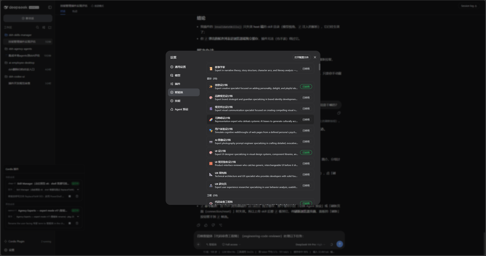
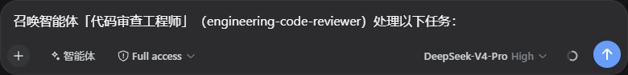

<div align="center">
  

  # DSH Agency Agents

  **271 summonable specialist agents for DeepSeek Harness**

  [中文](README.md) · [Documentation](docs/00-交接入口/00-阅读导航.md) · [Apache-2.0](LICENSE)

  [](LICENSE)
  [](docs/04-Agent运行体系/01-内置智能体清单/00-清单索引.md)
</div>

`dsh-agency-agents` is a DeepSeek Harness (DSH) plugin. The parent session keeps task context, judgment, and final synthesis; it can delegate a complete task to a one-shot subagent with a persona from The Agency.

## Use it in DSH

Browse and enable agents in the **Agents** settings panel. The plugin exposes the bundled agents by division, alongside their names, descriptions, and enabled state.



Choose **Agent** mode in the chat composer, then identify the agent by name and slug. For example:

```text
Summon the "Code Review Engineer" agent (engineering-code-reviewer) for this task:
Review the changes in the current workspace and list reproducible issues by severity.
```



## How it works

| Stage | Parent session and plugin responsibility |
| --- | --- |
| Discover | `list_experts(division?)` returns compact division counts, or expands one division. |
| Delegate | `summon_expert(expert, task)` starts a one-shot subagent by slug or unique name. |
| Deliver | The subagent returns its specialist result; the parent session applies the original context and produces the final response. |

- 271 agent personas are bundled; no external directory is required after installation.
- Configure `root`, or set `AGENCY_AGENTS_ROOT`, to use a separately synchronized agent directory.
- Agent children cannot call `summon_expert`, preventing recursive delegation.
- `spawn` and `fork` are supported when the provider supports persona and tool filtering.

## Install

```powershell
[Console]::OutputEncoding = [System.Text.Encoding]::UTF8
$OutputEncoding = [System.Text.Encoding]::UTF8
dsh plugin --profile default add .
dsh --profile default --dump-config
```

Replace `default` with the target profile. The second command should show the `agency-agents` composition entry.

## Configuration

| Key | Default | Meaning |
| --- | --- | --- |
| `root` | Bundled agent assets | External agent root; an explicit value overrides bundled assets. |
| `provider` | `spawn` | DSH subagent provider. |
| `divisions` | All 17 standard divisions | Top-level divisions to scan. |
| `maxDepth` | Unset | Optional absolute child-depth cap; the provider must support depth limiting. |

## Bundled source and licensing

The bundled agent personas originate from [The Agency](https://github.com/msitarzewski/agency-agents) and are copyrighted by AgentLand Contributors. The snapshot and its original license are in [assets\agency-agents](assets/agency-agents).

**License boundary:** this plugin's TypeScript source, build scripts, and project documentation are licensed under [Apache License 2.0](LICENSE). The bundled upstream agent personas remain under the MIT License; see [assets\agency-agents\LICENSE](assets/agency-agents/LICENSE). See [NOTICE](NOTICE) for attribution.

The complete roster is split by division in the [agent roster](docs/04-Agent运行体系/01-内置智能体清单/00-清单索引.md).

## Development and verification

```powershell
[Console]::OutputEncoding = [System.Text.Encoding]::UTF8
$OutputEncoding = [System.Text.Encoding]::UTF8
pnpm install
pnpm build
pnpm test
pnpm verify
```

`prepublishOnly` runs build, test, and package-integrity verification automatically.
